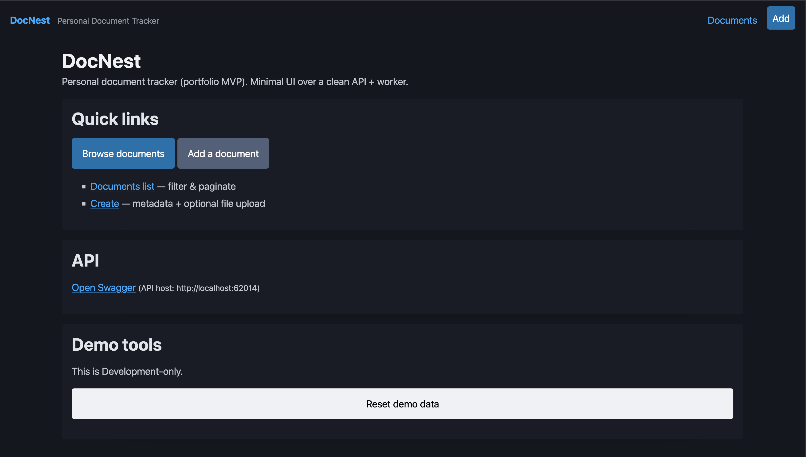
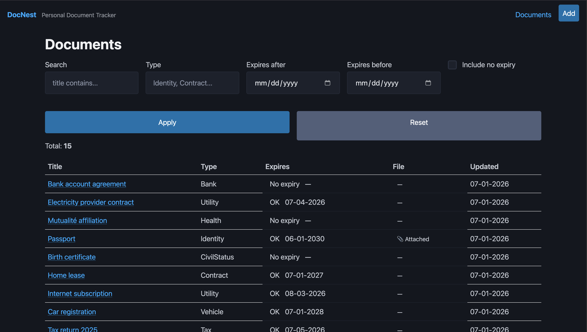
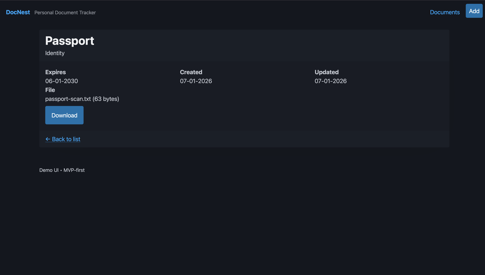
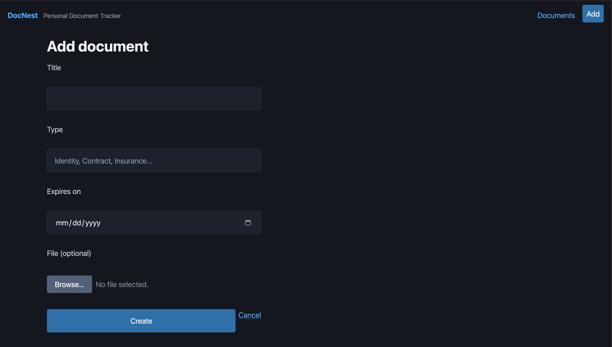

# DocNest

**DocNest** is a small personal document tracker designed to help individuals or households keep control over administrative documents and expiration deadlines.

It centralizes document metadata and files, tracks expiration dates, and generates reminders before important deadlines — while remaining intentionally **minimal, pragmatic, and finishable**.

This repository contains a **finished MVP**, not a commercial product.

---

## 📸 Screenshots

### Home
Entry point with navigation and demo tooling.

### Documents list
Browse documents with filters and expiration status.

### Document details
Inspect metadata and download attached files.

### Create document
Create documents with multipart forms, including an optional file upload.

---

## 🚀 Run locally

DocNest uses **.NET Aspire** for local development orchestration.

### Prerequisites
- .NET SDK (net10)
- Docker (required for PostgreSQL via Aspire)

### Start the application

From the repository root, run:

    dotnet run --project src/DocNestApp.AppHost

This starts:
- API
- Web UI
- Background worker
- PostgreSQL

### Access the application

- **Web UI**  
  http://localhost:8080

- **API Swagger**  
  Available via the link on the home page  
  (or directly on the API service port shown in the Aspire dashboard)

### Demo data

- Demo data can be reset in Development
- The Web UI exposes a **“Reset demo data”** button on the home page
- A development-only API endpoint is also available:

  POST /dev/reset-demo

---

## 🎯 General Goals

DocNest aims to:

- Centralize administrative documents
- Track expiration dates
- Generate reminders before deadlines 
- Support multiple subjects (household members) (authentication is out of scope for the MVP)
- Remain simple, maintainable, and shippable

The project deliberately prioritizes **clarity and delivery** over feature breadth.

---

## 🚫 Non-Goals

To keep scope under control, the MVP intentionally avoids:

- Microservices
- Message brokers (Kafka, RabbitMQ, etc.)
- Outbox / Inbox patterns
- Event sourcing
- Authentication & RBAC
- Generic repositories
- Heavy CQRS frameworks

Ideas outside the MVP scope are captured in `NOT_NOW.md`.

---

## 🧠 Architecture

### Vertical Slice Architecture

Each feature is implemented as a **vertical slice**, owning its full execution path:

- HTTP endpoint
- Validation
- Persistence
- Response shaping

This minimizes cross-cutting changes and avoids excessive scaffolding.

Example:

    Features/
        Documents/
            Create/
            List/
            Get/

### Clean-ish Boundaries

Clean Architecture principles are applied **pragmatically**:

- Domain logic enforces real invariants
- Infrastructure details may leak early if it improves speed
- Logic is promoted only when repetition or complexity justifies it

The goal is useful boundaries, not theoretical purity.

---

## 🧩 Domain Modeling Guidelines

- Keep logic inside a slice when:
    - It is trivial
    - Used only once
    - Does not enforce invariants

- Promote to a Value Object when:
    - Validation rules repeat
    - Formatting must be consistent
    - Invariants must never be broken

- Promote to a Domain Service when:
    - Logic spans multiple entities

- Promote to an Application Service when:
    - Orchestrating infrastructure (storage, background jobs)

---

## 📦 MVP Scope

The MVP focuses on **three core user journeys**:

### 1. Add a document
- Metadata (title, type, subject, expiration)
- Optional file upload

### 2. Browse and inspect documents
- List with pagination and light filtering
- Expiration status indicators
- View details
- Download attached files

### 3. Expiration reminders
- Background worker checks expiring documents
- Reminder generation is idempotent
- Due reminders are dispatched (currently logged)

---

## 🧱 Technical Stack

### Backend
- **.NET** (net10)
- **FastEndpoints**
- **EF Core**
- **PostgreSQL**
- **FluentValidation**
- **OpenAPI / Swagger**

### Frontend
- **Razor Pages**
- Minimal UI using **Pico.css**
- Exists to demonstrate API usage, not as a full client

### Local Development
- **.NET Aspire** (development-time orchestration only)
    - API
    - Web UI
    - Background worker
    - PostgreSQL

All services can run **standalone** without Aspire.

---

## 🧪 Testing Strategy

- **Integration tests** using Testcontainers + real PostgreSQL
- Tests cover:
    - Document creation & retrieval
    - Listing & filtering
    - Reminder generation & dispatch
- Focus on testing **real user flows**, not internal abstractions

---

## 🧪 Demo Mode

- Demo data can be seeded automatically
- A development-only endpoint allows resetting demo data
- The Web UI exposes a “Reset demo data” button in Development

This makes the project easy to explore without manual setup.

---

## 🧠 Finishing Philosophy

DocNest follows a strict **“MVP Done”** definition:

The project is considered done when:
- It runs with a single command (Aspire)
- Demo data is available
- The 3 MVP user journeys are complete
- Documentation and screenshots exist

Anything beyond this is optional.

---

## 📜 License

MIT License.
